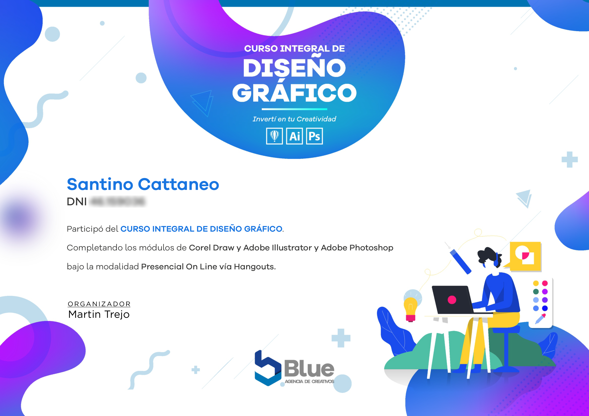

Hola, soy Santino Cattaneo 👋

¡Bienvenido a mi perfil de GitHub!
Acerca de mí 🌐

    🌍 Ubicación: Córdoba, Argentina
    🎓 Formación: Diseño grafico (blue agencia), Programación Web FullStack (DigitalHouse), Ciberseguridad (CoderHouse)
    👨‍💻 Edad: 18 años

Experiencia y habilidades 🚀

    💻 Programación: HTML, CSS, JS, TS, React, Python
    🌐 Diseño grafico: Adobe photoshop, Adobe illustrator y mas
    👥 Colaboraciones: Buen comunicador, disfruto del trabajo en equipo, adaptable y con mentalidad abierta

Proyectos destacados 🔥

[Protech Labs](https://protechlabs.netlify.app)
[Goosep Clothes](https://instagram.com/goosep.clothes)

Contacto 💻

¡Si deseas colaborar o contactarme, estoy disponible en las siguientes plataformas:

    GitHub: SantiCattaneoDev
    Correo electrónico: santinocatta@gmail.com
    LinkedIn: Santino Cattaneo

## Certificado 🥇

¡Gracias por visitar mi perfil! Estoy emocionado de seguir aprendiendo y creciendo como programador. No dudes en contactarme si tienes alguna pregunta o propuesta.¡Hagamos cosas increibles juntos!

<!--
**SantiCattaneoDev/SantiCattaneoDev** is a ✨ _special_ ✨ repository because its `README.md` (this file) appears on your GitHub profile.

Here are some ideas to get you started:

- 🔭 I’m currently working on ...
- 🌱 I’m currently learning ...
- 👯 I’m looking to collaborate on ...
- 🤔 I’m looking for help with ...
- 💬 Ask me about ...
- 📫 How to reach me: ...
- 😄 Pronouns: ...
- ⚡ Fun fact: ...
-->
